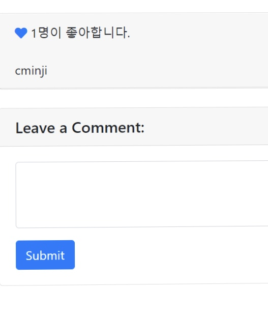

## 11.09.20

allauth를 이용해서 로그인, 회원가입, log in with google 쉽게 구현하기! 

>사진
 -로그아웃상태

 -로그인상태

 -로그아웃상태에서 좋아요

 -로그인상태에서 좋아요

## 26.08.20

### 결과물 스크린 샷!
-블로그 홈

-블로그 글

-블로그 댓글 작성 01

-블로그 댓글 작성 02

-블로그 댓글 삭제

-블로그 댓글 수정 01

-블로그 댓글 수정 02

-블로그 게시글 수정 01

-블로그 게시글 수정 02

-블로그 게시글 수정 03

-블로그 게시글 삭제

-블로그 게시글 작성

-블로그 게시글 작성 02

-블로그 새 게시글 확인 및 10개 게시글 랜덤으로 만들기

-블로그 게시글 랜덤 작성 확인 1

-블로그 게시글 랜던 작성 확인 2

>ForeignKeyField가 바라보는 값(연결된 게시물)이 삭제 될 때, 처리 옵션  
CASCADE: 부모(게시물)가 삭제 되면, 자기 자신(댓글)도 삭제. 
게시글에 대한 모델 클래스인Post에 따라 생성된 게시글이 삭제되면,
댓글에 대한 모델 클래스인 Comment에 따라 생성된 댓글도 삭제. 
PROTECT: 댓글이 존재하면, 게시물 삭제 불가능(ProtectedError발생시킴) 
SET_NULL: 게시물이 삭제되면, 댓글의 게시물 정보를 NULL로 변경.