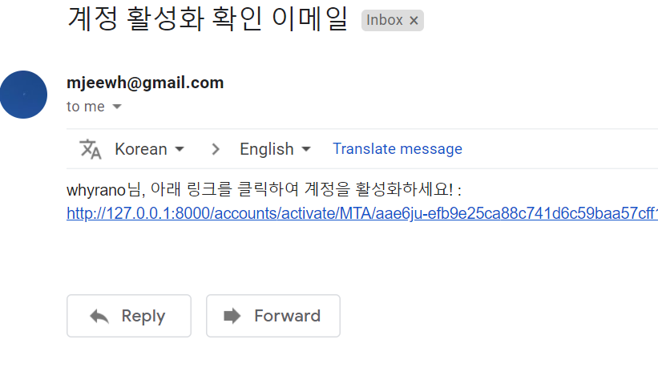

## Sign up access email

## Sign up, Log in, Log out

<i>POST, GET</i>잘 분류해서 매소드에 넣기. 
<i>URL</i> 잘 적용시키기

superuser info.
- name; choi
- ps; 0703

basic_user info.
- name; whyrano
- ps; 0123456789
